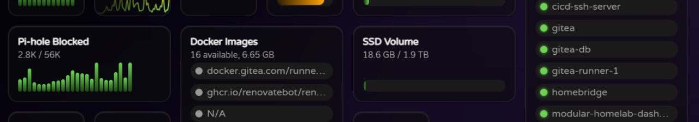

# Pi-hole Plugin

The Pi-hole plugin allows you to monitor your Pi-hole instance directly from the dashboard. It fetches data such as query count, blocked queries, and other statistics.

This requires access to the Pi-hole API, which can be provided by setting the the Pi-hole url in the config.yaml file:

```yaml
plugins:
  pihole:
    url: https://your-pihole-instance.com
```

Additionally, you need to provide a Pi-hole app or user password. This token should be set as an environment variable `PIHOLE_PASSWORD`:

```yaml
environment:
  - PIHOLE_PASSWORD=${PIHOLE_PASSWORD}
```

## Data Points

- `blocked` - The number of blocked DNS queries
- `blocked.percentage` - The percentage of DNS queries that were blocked
- `cached` - The number of cached DNS queries
- `clients.active` - The number of active clients using Pi-hole
- `forwarded` - The number of DNS queries forwarded to upstream DNS servers
- `totalQueries` - The total number of DNS queries processed by Pi-hole
- `sessions.count` - The number of active Pi-hole admin UI/API sessions

## Example Configuration

```yaml
widgets:
  # Show number of blocked DNS queries as a bar chart
  - type: datawidget
    subtype: bar
    title: Pi-hole Blocked
    datasource: pihole
    datapoint: blocked
    width: 2

  # Show total number of Pi-hole sessions as a bar chart
  - type: datawidget
    subtype: bar
    title: Pi-hole Sessions
    datasource: pihole
    datapoint: sessions.count
    width: 1
```
