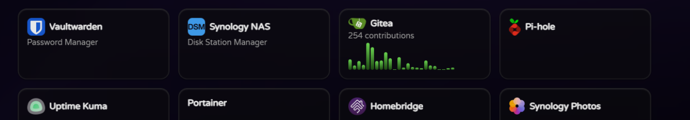

# Text Widget

Displays a tile that contains static text. This widget is useful for displaying information that doesn't change frequently, works similarly to the Link Widget but without the need for a URL.

## Configuration Options

| Property   | Required | Description                                      |
| ---------- | -------- | ------------------------------------------------ |
| `title`    | Yes      | The title to display                             |
| `url`      | No       | The URL to navigate to when the tile is clicked. |
| `subtitle` | No       | The subtitle to display                          |
| `width`    | No       | The width of the tile (e.g., 1, 2).              |
| `height`   | No       | The height of the tile (e.g., 1, 2).             |

## Configuration Example

```yaml
widgets:
  - type: text
    title: My Dashboard Title
    subtitle: Click to visit example.com
    width: 2
```
