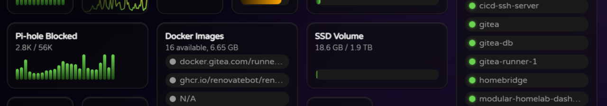
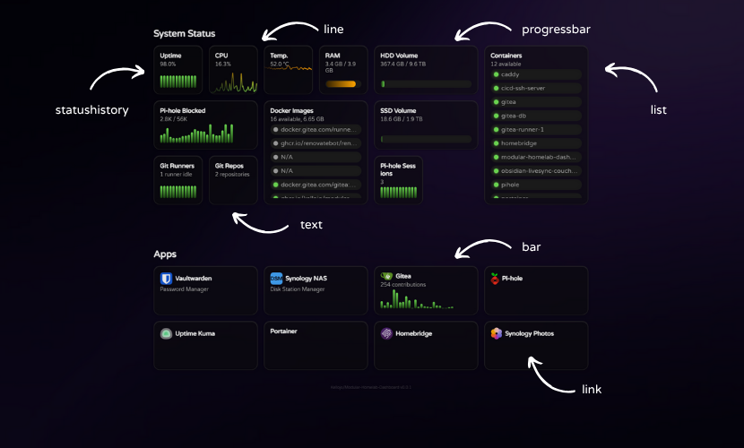

# Data Widget

Displays a tile that contains dynamic data. This widget is useful for displaying information that should be pulled from an external source via a built-in integration/plugin. This widget requires additional configuration depending on the data source being used and the type of data being displayed.

By default the data will be refreshed every 10 seconds and a history of up to 100 entries will be kept for plugins that support historical data.

## Configuration Options

| Property      | Required | Description                                                                                              |
| ------------- | -------- | -------------------------------------------------------------------------------------------------------- |
| `subtype`     | Yes      | The subtype of the data being displayed. Can be either line, bar, statushistory, progressbar, list, fill |
| `datasource`  | Yes      | The plugin to use for fetching the data (i.e. system, pihole, ...)                                       |
| `datapoint`   | Yes      | The specific data point to display (i.e.cpu.temperature, memory, ...)                                    |
| `datafilters` | No       | The data filter to apply, some plugins might require or support a specific filter to be supplied.        |
| `title`       | Yes      | The title to display                                                                                     |
| `subtitle`    | No       | The subtitle to display, in most cases this will be set by the plugin                                    |
| `url`         | No       | The URL to navigate to when the tile is clicked.                                                         |
| `width`       | No       | The width of the tile (e.g., 1, 2).                                                                      |
| `height`      | No       | The height of the tile (e.g., 1, 2).                                                                     |
| `icon`        | No       | The icon to display in the tile.                                                                         |
| `iconify`     | No       | The Iconify icon to display in the tile.                                                                 |
| `iconRounded` | No       | Show the icon with rounded corners.                                                                      |

## Configuration Example

```yaml
widgets:
  - type: datawidget
    subtype: progressbar
    title: RAM
    datasource: system
    datapoint: memory
    width: 1
```

## Supported Subtypes

The following subtypes are supported for the data widget:

- line
- bar
- statushistory
- progressbar
- list
- fill

Below you can see some of them in action:



You can find usage examples for the widgets here.
