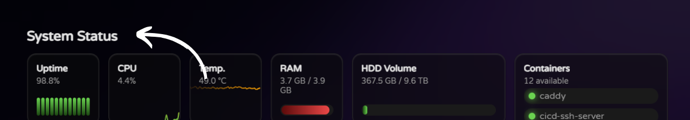

# Title Widget

Displays a title for the dashboard or a specific section, always taking the full width of the dashboard, allowing for clear separation between different sections (i.e. monitoring, media, etc.).

## Configuration Options

| Property | Required | Description          |
| -------- | -------- | -------------------- |
| `title`  | Yes      | The title to display |

## Configuration Example

```yaml
widgets:
  - type: title
    title: My Dashboard Title
```
