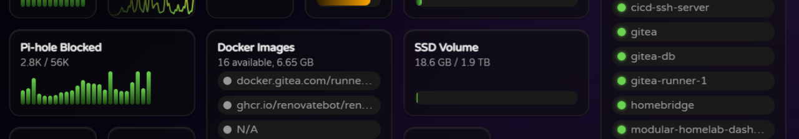
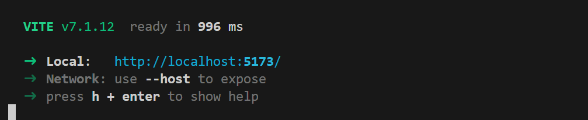

# Development Setup

To set up a development environment for the Homelab Dashboard, please follow the steps below:

1. **Clone the Repository**: Start by cloning the Homelab Dashboard repository to your local machine.
2. **Install Dependencies**: Navigate to the project directory and install the project dependencies using `npm i`
3. **Set Up Environment Variables**: Create a `.env` file in the root of the project and add any necessary environment variables/secrets required by the plugins you want to test/work on.
4. **Run the Development Server**: Start the development server using `npm run dev`. This will launch the application in development mode, allowing you to make changes and see them reflected in real-time.

## What can I contribute?

Thank you for your interest in contributing to the Homelab Dashboard! Take a look at the [Roadmap](#Roadmap) to see planned features and improvements.

All contributions are welcome, whether it's fixing bugs, adding new features, improving documentation, or enhancing existing functionality. If you have an idea for a new feature or improvement, feel free to open an issue to discuss it before starting work.
