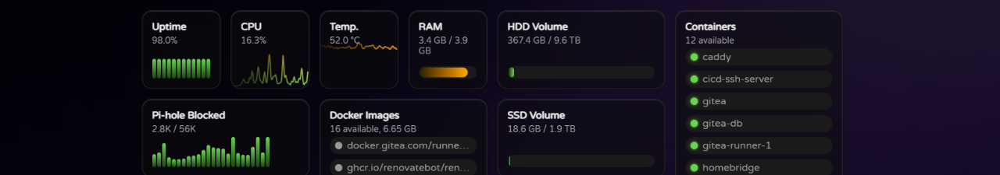

# Features

- Modular design: Easily add or remove widgets to customize your dashboard.
- Secure backend: Fetch data securely from your homelab services without exposing sensitive information.
- YAML configuration: Simple and intuitive configuration using a YAML file.
- Responsive design: Works well on various screen sizes and devices, even your phone!
- Provides widgets for popular homelab services like Pi-hole, Docker, Gitea and many more.
- Easily extendable: integrate your own services by following the integration guide.
