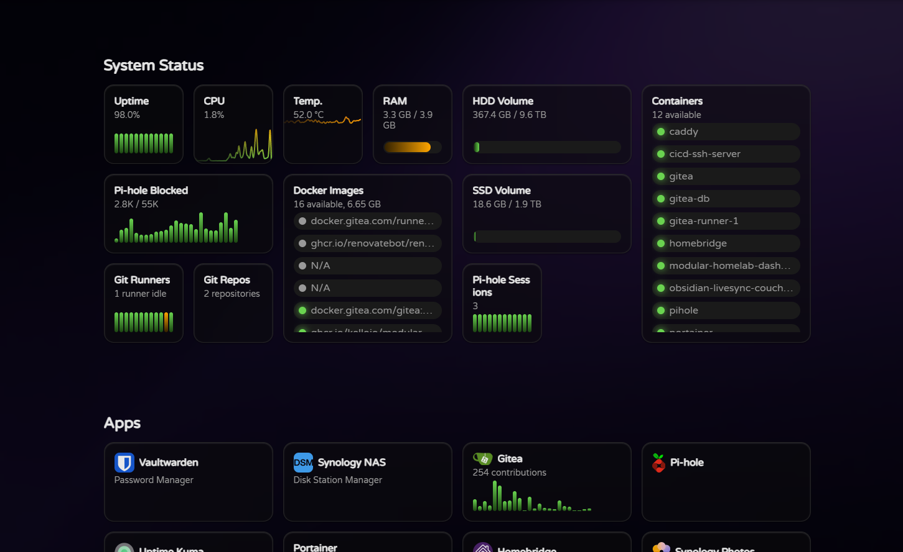

# What is Modular Homelab Dashboard?

**Modular Homelab Dashboard** allows quickly setting up a dashboard/entry point for your homelab. It provides a customizable interface allowing you to display various metrics, system statuses, and other information from your homelab services.

Everything is **configured in a simple yaml file** with a **backend to securely fetch data from your homelab services**, without exposing credentials/API keys to the end user.

Best of all, it is **modular**: you can easily add or remove widgets to customize your dashboard to your needs!

Get started by checking out the [Installation Guide](#Getting-Started) and available [Features](#Features).
