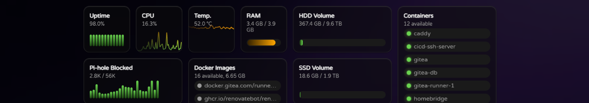

# Getting Started

[Docker Compose](https://docs.docker.com/compose/) is the recommended way to run Modular Homelab Dashboard. Make sure you have Docker and Docker Compose installed on your system. You can find all available versions on the [GitHub Container Registry](https://github.com/Kellojo/Modular-Homelab-Dashboard/pkgs/container/modular-homelab-dashboard).

1. Add the following service to your existing `docker-compose.yaml` file:

```yaml
services:
  modular-homelab-dashboard:
    image: ghcr.io/kellojo/modular-homelab-dashboard:latest
    container_name: modular-homelab-dashboard
    restart: unless-stopped
    pid: "host"
    volumes:
      - ./config.yaml:/app/dashboard.yaml:ro # your dashboard config
      - ./background.jpg:/app/build/client/background.jpg:ro # optional custom background
```

2. Create a `config.yaml` file and mount it to `/app/dashboard.yaml` in the container:

```yaml
config:
  historyLength: 100
  refreshCron: "*/5 * * * * *"
  disableSeasonalEvents: false
  background:
    url: ./background.jpg
    blur: 0.5rem
    brightness: 0.25

plugins:
  # See available plugins in the documentation

widgets:
  - type: title
    title: System Status

  - type: datawidget
    subtype: line
    title: CPU
    datasource: system
    datapoint: cpu.load

  - type: title
    title: Apps

  - type: link
    url: https://pihole.local/admin
    title: Pi-hole
    icon: https://cdn.jsdelivr.net/gh/walkxcode/dashboard-icons/png/pi-hole.png
    width: 2
```

3. Start the container and access it on port 3000 🎉

## Additional Configuration

Some plugins might require additional settings or volume mounts. For basic usage of the docker and system plugins the following configuration is needed:

```yaml
modular-homelab-dashboard:
  image: ghcr.io/kellojo/modular-homelab-dashboard:v1.1.4
  container_name: modular-homelab-dashboard
  restart: unless-stopped
  pid: "host" # Allows access to host system metrics
  volumes:
    - ./config.yaml:/app/dashboard.yaml:ro # your dashboard config
    - ./background.jpg:/app/build/client/background.jpg:ro # optional custom background
    - /volume1/some-empty-subfolder:/volume1:ro # allows access to other volumes for disk stats
    - /volume2/some-empty-subfolder:/volume2:ro # allows access to other volumes for disk stats
    - /proc/meminfo:/proc/meminfo:ro # Allows the system plugin to read memory info
    - /proc/cpuinfo:/proc/cpuinfo:ro # Allows the system plugin to read cpu info
    - /var/run/docker.sock:/var/run/docker.sock # Allows the docker plugin to read docker stats
```
